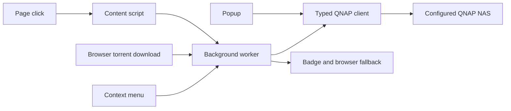

# QuickGet Remote: current system

QuickGet Remote 2.6.0 is a browser extension for one QNAP NAS running Download Station. It has no hosted backend, user accounts, multi-NAS selection, analytics, or cloud synchronization. Chromium uses an MV3 service worker; Firefox has its own MV3 manifest and background-script configuration.

## User journeys

| Intent | Entry | Owner | Result |
|---|---|---|---|
| Send a torrent link | Normal browser download | [[torrent-handoff]] | Browser fetch/upload to NAS; browser download cancelled after acceptance |
| Send a magnet | Page click | [[page-capture]] | `AddUrl`, with native handling restored on failed send |
| Send an ordinary file | Opted-in click or Shift-click | [[page-capture]] | NAS downloads the URL; the browser does not proxy file bytes |
| Send a selected link | Context menu | [[context-menu]] | Shared classifier selects torrent upload or URL transport |
| Upload local torrent or URLs | Popup | [[popup-upload]] | A task is added and the list refreshes |
| Inspect/manage existing tasks | Popup | [[task-management]] | Query, actions, queue order, and torrent file priorities |
| Configure connection and routing | Settings | [[settings]] and [[routing-folders]] | Browser-local settings and per-send destination |

## Boundaries and ownership

The popup and background each own API client caches within their execution context. The background alone writes the browser action badge. The popup supplies fresh task counts by message; background alarms keep monitoring alive when the popup closes. Download cancellation belongs to the browser-download transaction, while page navigation fallback belongs to the content script.

## Data and security

The NAS password is saved in browser-local extension storage and mirrored in session storage; it is not encrypted by QuickGet. The optional settings password is a separate UI lock, not credential encryption. [Security and storage](settings.md#storage-and-security) describes this boundary. Torrent-source requests can contact the user-selected tracker; credentials for NAS login are sent to the configured NAS, not the tracker. Ordinary URL tasks are fetched by the NAS itself.

## Current limitations

No offline send queue, post-send undo, activity-history product, automatic session-cookie forwarding for ordinary files, or multi-NAS support is implemented. Missing URL-redirect handling and inconsistent send feedback remain separate findings, not features silently claimed as working. [[feature-review]] maps these limits to existing tasks.

## Verification

The extension has unit, fixture-contract, mock-browser E2E, and a local real-NAS release spot check. Documentation review means inspected behavior, not a fresh NAS run. [[verification]] identifies what each layer proves. [The feature registry](../features.json) is the coverage denominator; [[coverage]] reports its current state.
